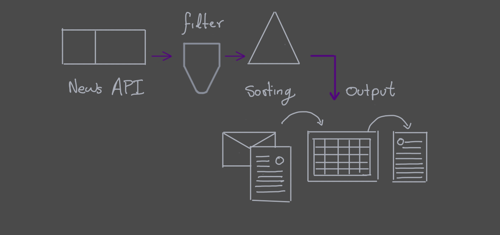

# News Aggregator

News aggregator that fetch news form Newsapi and writhe the results in a Google spreadsheet.

## Why I want News aggregator

Every morning I read news, to find the news I browse several sites, and in some cases end spending more time scrolling o the sites that reading the news.  

## The Idea

A spreadsheet with different sheets, one sheet per topic. Each sheet contain the 4 most relevant news about a topic. In the sheet each row will represent and article, there will be columns with information such as author, source, summery and link to the full article.

## Getting Started

1. Install the libraries.
2. define the topics to search
3. Get the Google sheets API token as well as NewsAPI key.
4. Execute the scrip.

> for now the script contain hardcoded values, but again, this meant to be a personal project, I will work on it.

## Built With

* [NewsAPI](https://newsapi.org/docs) - The News API
* [Google Sheets](https://developers.google.com/sheets/api?hl=ru) - Sheets API

## Changelog

|version | Date | Description|
|:-----|:-------:|:----------|
|0.1.0 | 20210914| Moving NewsAPI related code to independent file.|
|0.2.0 | 20211011| Started using the unofficial python client for news API|
|0.3.0 | 20211131| Pre-alpa: Fetch news and write them in a spreadsheet |

## Versioning

**MAYOR.MINOR.PATCH**

* MAJOR version when you make incompatible API changes,
* MINOR version when you add functionality in a backwards compatible manner, and
* PATCH version when you make backwards compatible bug fixes.  

I use [SemVer](http://semver.org/) for versioning. 

## Authors

* **Victor Andres Aguirre Fernandez** -  [CubeVic](https://github.com/CubeVic)
